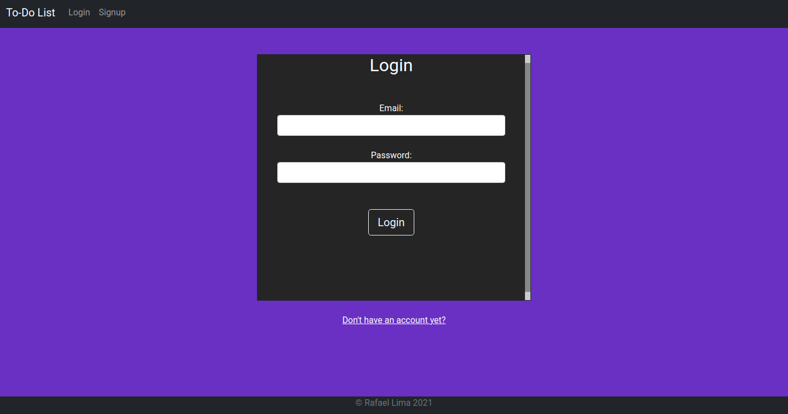

# to-do-list-django
Basic to-do list application built with Django.

You can access the app at https://to-dolistdjango.herokuapp.com/

## To-Do List

## Fatures
- [x] Full CRUD functionality 
- [x] User Registration
- [x] User authentication 

## Built with
- [Python 3](https://www.python.org/)
- [Django](https://www.djangoproject.com/)
- [HTML5](https://dev.w3.org/html5/html-author/)
- [CSS](https://devdocs.io/css/)
- [Bootstrap](https://getbootstrap.com/)

## Setup
First clone the repository from Github and switch to the new directory:

    $ git clone git@github.com:rafaellima47/to-do-list-django.git
    $ cd to-do-list-django
    
Activate the virtualenv for your project.

Install project dependencies:

    $ pip install -r requirements.txt
    
    
Apply the migrations:

    $ python manage.py migrate

Run collectstatic:

    $ python manage.py collectstatic
    

You can now run the development server:

    $ python manage.py runserver
